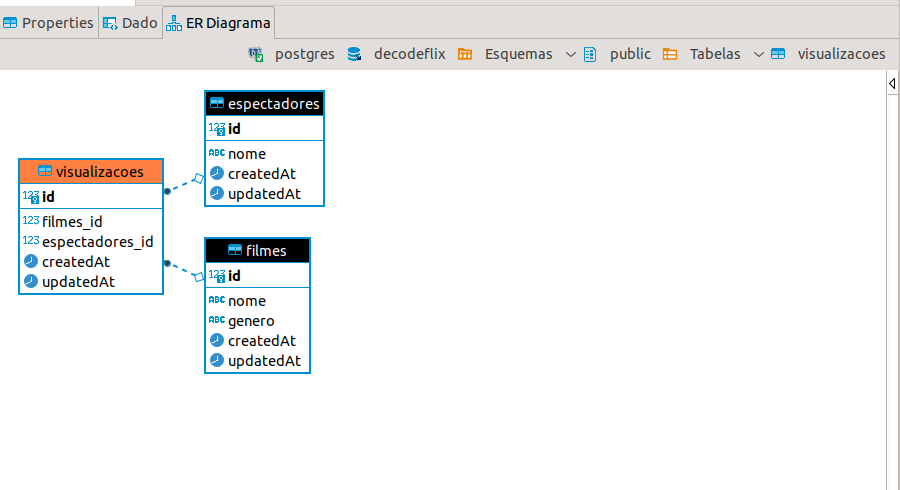

# DecodeFlix

Project developed that performs the registration of films and returns reports from them

# O que faz?

- Cadastro de Filmes
- Pesquisa de Filmes
- Cadastro de Espectadores
- Pesquisa de Espectadores

# Serviço REST

Base_URL: https://decodeflix.herokuapp.com/api

- Login GET - Filmes

 {{ _.base_url }}/filmes 

<code>
 Resposta:

    "filmes": [
        {
            "id": 1,
            "nome": "Vovozona",
            "genero": "Comédia",
            "createdAt": "2021-07-26T07:21:10.968Z",
            "updatedAt": "2021-07-26T07:21:10.968Z"
        },
        {
            "id": 2,
            "nome": "Todo mundo em pânico",
            "genero": "Comédia",
            "createdAt": "2021-07-26T07:21:10.969Z",
            "updatedAt": "2021-07-26T07:21:10.969Z"
        },
        {
            "id": 3,
            "nome": "Minha mãe é uma peça",
            "genero": "Comédia",
            "createdAt": "2021-07-26T07:21:10.969Z",
            "updatedAt": "2021-07-26T07:21:10.969Z"
        }
    ]

</code>
	
- Filme por espectadores

    <code> GET - {{ _.base_url }}/filmes/2/espectadores   </code>
    
 Exemplo do body de resposta:  

<code>
	{
  "filmes": {
    "message": "1 espectadores viram o filme"
  }
}
</code>

- Cadastro de filme
  <code> POST - {{ _.base_url }}/filmes </code>
  
 Exemplo do body de requisição: 

  <code>
  {
  "nome":"Pernalonga",
  "genero": "Infantil"
  }
  </code>

- Lista de Espectadores:

      <code> GET - {{ _.base_url }}/espectadores  </code>
      
 Exemplo do body de resposta:  

  <code>
  {
    "espectadores": [
      {
        "id": 2,
        "nome": "Hiran Neri",
        "createdAt": "2021-07-26T02:16:18.815Z",
        "updatedAt": "2021-07-26T02:16:18.815Z"
      },
      {
        "id": 3,
        "nome": "José Silva",
        "createdAt": "2021-07-26T02:16:18.815Z",
        "updatedAt": "2021-07-26T02:16:18.815Z"
      }
    ]
  }
  </code>

<code> Cadastrar Espectadores - POST - {{ _.base_url }}/espectadores </code>

 Exemplo do body de requisição: 

<code>
{
"nome": "Silvio"
}
</code>

<code> GET - Espectadores por filme {{ _.base_url }}/espectadores/3/filme/2 </code>

 Exemplo do body de resposta: 

<code>
{
  "filmes": {
    "message": "Foram vistos 1 filme(s)"
  }
}
</code>

<code> POST - Marcar filme como visto {{ _.base_url }}/espectadores/3/filme/2/visto </code>

 Exemplo do body de requisição: 

<code>
{
	"filme":"Todo mundo em pânico"
}
</code>
Resposta:
<code>
{
  "message": "Marcado como visto"
}
</code>

# Utilização do projeto

- Realizar o clone do projeto
- Instalação do banco de dados Postgres

# Banco

- Atualmente no projeto a porta configurada é 5432, mas as configurações poderão ser alteradas conforme a necessidade

- Para criação das tabelas, no seu terminal digite o comando dentro da pasta do projeto:
  <code> sequelize-cli db:migrate && sequelize-cli db:seed:all </code>

  - MER

    

      
  

# Tecnologias Usadas:

- NodeJS
- Express
- Sequelize
- Banco de Dados: PostgreSQL
- Sustentado no Heroku

# Melhorias

- Descrição dos endpoints pelo o Swagger
- Autenticação via jwt
